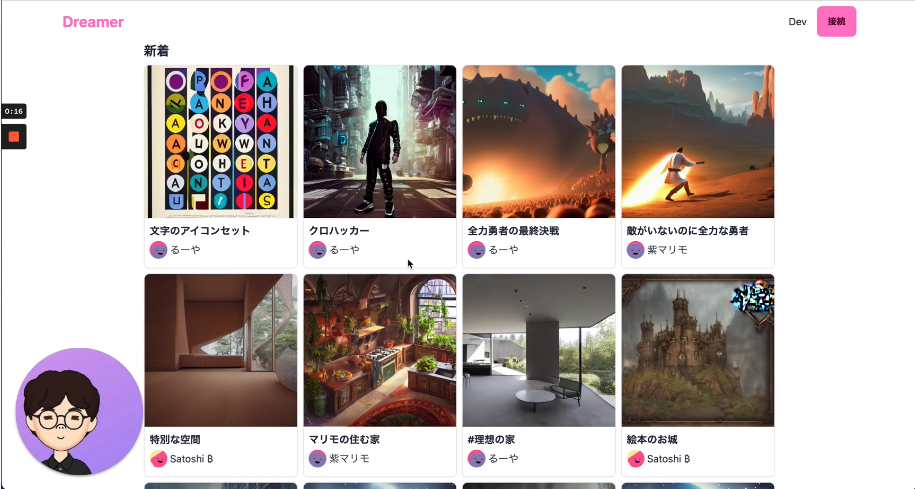
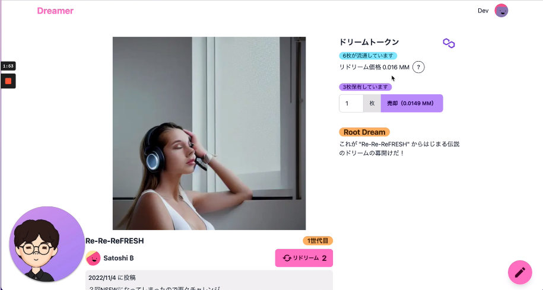

# Dreamer

Tokyo Web3 Hackathon 2022参加作品

## プロダクト概要

Dreamerは、人が作るプロンプトとAIが作る画像がセットになった **"ドリーム"** の投稿サイトです。

ドリームするためにはトークンを1枚購入する必要があります。購入すると画像生成をリクエストでき、問題なく生成されると投稿完了となります。

一方、他の投稿されたドリームを継承する機能があり、これを **"リドリーム"** と呼びます。リドリームの画像は、入力したプロンプトと元のドリームの画像の２つから生成されます。

はじめは1つのドリームでしたが、リドリームされることで木構造のコンテンツとなるため、これをドリームツリーと呼びます。これはERC1155のTokenIDに対応し、購入額や売却額は、所属するツリーのトークンの供給量に比例します。

Aliceが作成したドリームをBobがリドリームし、それをCharlieがリドリームした瞬間、Aliceがトークンを売却していない場合Bobは今売却することで利益を獲得できます。

## 技術スタック

- App
  - Nextjs
  - Design
    - tailwindcss
    - daisyUI
  - Auth
    - NextAuth
    - SIWE
  - DB
    - prisma
    - docker/postgres
  - Blockchain interaction
    - ethers.js, wagmi, rainbowkit
    - alchemy SDK
- Smart contract
  - Solidity
  - Hardhat
- Common
  - Typescript

## 使用したチェーンとコントラクト

Polygon Mumbai

|Contract|Address|
|---|---|
|Dreams|[0xd1ADe9283f3c781D4412e983759A0A3040Cde9f4](https://mumbai.polygonscan.com/address/0xd1ADe9283f3c781D4412e983759A0A3040Cde9f4#readContract)|

## コードやビルドについて

秘密情報以外はすべてこのリポジトリに含まれています。

ローカルで動かすにはAPIキーの取得等が必要になるのでその方法は省略します。